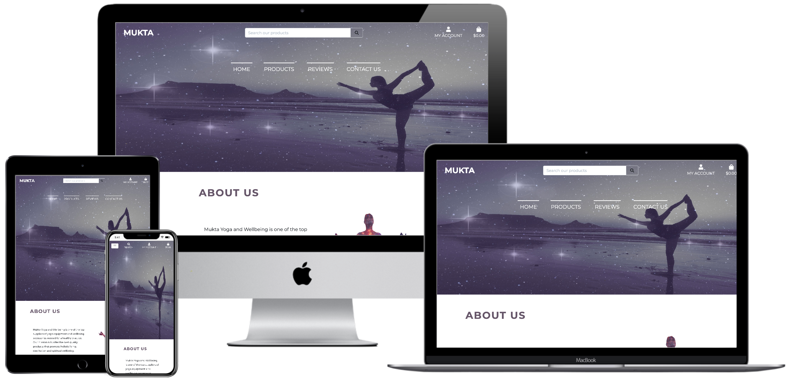

# Mukta - Yoga and Wellbeing



## Introduction

[This is](https://mukta-project.herokuapp.com/) Mukta - Yoga and Wellbeing. An e-commerce website developed by Mariana Stefani. This website is for everyone who is after great quality wellbeing and yoga products.
Here the user can also check out the yoga and wellbeing workshops that are taking place in the city of London.

## UX (User Experience)

### Project Goals

The purpose of this project is to offer the best quality yoga and wellbeing products.
Users will have the possibility to register on the website, choose products in the store, add to the shopping cart and make the payment. Once registered, the user can also check which wellbeing and yoga events are taking place in the city of London and can leave reviews regarding their past purchases, the website as well as workshops they have attended.

#### **User Goals:**

- Browse yoga and wellbeing products at a good price.
- Choose what yoga and wellbeing products I'd like to buy, add them to the shopping cart and pay.
- Find yoga and wellbeing classes or workshops that are happening in the city of London.
- Be able to write, edit and delete a review about my experience with my purchase/ website navigation/ workshops I have attended.

#### **User Stories:**

- As a user, I expect to browse what products the website offers.
- As a user, I expect to find the product I'm looking for, add it to the shopping bag and pay for it. All with intuitive navigation.
- As a user, I expect to be able to register to the website so it will keep my details for future purchases as well as be able to check my previous purchases.
- As a user, I expect to be able to leave a review regarding the product I have purchased or about the website or about a workshop I had been to. Also, I want to be able to edit or delete this review.
- As a user, I expect to find the best workshops and events about yoga or wellbeing happening in London.

#### **Site Owner Goals:**

As a superuser:

- I expect to be able to log in as a superuser and create, update and delete products and workshops on the website.
- I expect to provide users with a safe and secure e-commerce platform.
- I expect to encourage users to register on the site, so they will have access to the best yoga and wellbeing workshops taking place in London.
- I need to be able to attract attention to my products.

## User Requirements and Expectations:

**Requirements:**

- Navigate through the pages of the website intuitively.
- The content displayed in a visually appealing manner.
- Navigate the website on any device.
- Add products to the shopping cart and update the basket amounts.
- Buy items in the shopping cart in a safely and securely.
- View past orders and user details on my profile section.
- Add, edit and delete reviews.

**Expectations:**

- Navigation takes the user directly to the desired page of the website.
- The users' payment data will not be kept in the website's database.
- The website will guarantee the safe storage of user details.
- The website will have intuitive navigation.
- The website will have a responsive design.
- Content is well presented and visually satisfying.

## Wireframes

The wireframes for this project were created at [Moqups](https://moqups.com/).
View my wireframes [here](https://github.com/mariana-stefani/mukta-project/tree/master/wireframes).

## Features

### Existing Features

- Users can create an account, log in, view past orders and have access to the workshops page.
- A 'my profile' section where users can see previous purchases and update their details.
- Users can create, update or delete a review when logged in.
- A 'reviews' page where users can read other users reviews.
- A 'my reviews' page where users can create, edit, delete a review as well as read their past reviews.
- A search bar that displays the website products based on the users' search query.
- A products page where users can click on the item and will be directed to the product details page.
- A product details page, where users can read the product description and manage the quantities to add to bag. If I'm a superuser I can add, edit and delete a product by clicking on respective buttons.
- A shopping cart where users can add the products they would like to purchase and update their quantities.
- A 'checkout' page, where users can pay for their chosen items using the Stripe API which will process the payment details and place their order.
- A workshop page, where users can find yoga and wellbeing workshops in London.
- A workshop details page, where users can read all information about that workshop. If I'm a superuser I can add, edit and delete a workshop by clicking on respective buttons.
- A contact page, where users can find Mukta's office address, e-mail and telephone number. There's also a map with the office location.

### Features Left to implement

- Add more products.
- Create a 'contact us' form.
- Users can register with their social media accounts.
- A reset password link.
- Order confirmation emails to be sent to the customer when customer places an order.

## Information Architecture

### Database Choice:

- During the development of this project, I worked with the standard **sqlite3** database that comes installed with Django.
- In the production version of Mukta - Yoga and Wellbeing, the database is a **PostgreSQL** database, hosted and provided by **Heroku**.

### Mukta Yoga and Wellbeing Data Models:

The user model used in this project is provided by Django. You can find more information about this [here](https://docs.djangoproject.com/en/3.0/ref/contrib/auth/)

#### The Order Model

| _Title_          | _Key in DB_     | _Form Validation type_                                                               | _Data type_   |
| ---------------- | --------------- | ------------------------------------------------------------------------------------ | ------------- |
| Order Number     | order_number    | max_length=32, null=False, editable=False                                            | CharField     |
| User Profile     | user_profile    | UserProfile, on_delete=models.SET_NULL, null=True, blank=True, related_name='orders' | ForeignKey    |
| Full Name        | full_name       | max_length=50, null=False, blank=False                                               | CharField     |
| Email            | email           | max_length=254, null=False, blank=False                                              | EmailField    |
| Phone Number     | phone_number    | max_length=20, null=False, blank=False                                               | CharField     |
| Country          | country         | blank_label='Country \*', null=False, blank=False                                    | CountryField  |
| Post Code        | postcode        | max_length=20, null=True, blank=True                                                 | CharField     |
| Town or City     | town_or_city    | max_length=40, null=False, blank=False                                               | CharField     |
| Street Address 1 | street_address1 | max_length=80, null=False, blank=False                                               | CharField     |
| Street Address 2 | street_address2 | max_length=80, null=True, blank=True                                                 | CharField     |
| County           | county          | max_length=80, null=True, blank=True                                                 | CharField     |
| Date             | date            | auto_now_add=True                                                                    | DateTimeField |
| Delivery Cost    | delivery_cost   | max_digits=6, decimal_places=2, null=False, default=0                                | DecimalField  |
| Order Total      | order_total     | max_digits=10, decimal_places=2, null=False, default=0                               | DecimalField  |
| Grand Total      | grand_total     | max_digits=10, decimal_places=2, null=False, default=0                               | DecimalField  |
| Original Bag     | original_bag    | null=False, blank=False, default=''                                                  | TextField     |
| Stripe PID       | stripe_pid      | max_length=254, null=False, blank=False, default=''                                  | CharField     |

#### The OrderLineItem Model

| _Title_         | _Key in DB_    | _Form Validation type_                                                             | _Data Type_  |
| --------------- | -------------- | ---------------------------------------------------------------------------------- | ------------ |
| Order           | order          | Order, null=False, blank=False, on_delete=models.CASCADE, related_name='lineitems' | ForeignKey   |
| Product         | product        | Product, null=False, blank=False, on_delete=models.CASCADE                         | ForeignKey   |
| Product Colour  | product_colour | max_length=2, null=True, blank=True                                                | CharField    |
| Quantity        | quantity       | null=False, blank=False, default=0                                                 | IntegerField |
| Line Item Total | lineitem_total | max_digits=6, decimal_places=2, null=False, blank=False, editable=False            | DecimalField |

#### The Category Model

| _Title_       | _Key in DB_   | _Form Validation type_                | _Data Type_ |
| ------------- | ------------- | ------------------------------------- | ----------- |
| Name          | name          | max_length=254                        | CharField   |
| Friendly Name | friendly_name | max_length=254, null=True, blank=True | CharField   |

#### The Product Model

| _Title_     | _Key in DB_ | _Form Validation type_                                       | _Data Type_  |
| ----------- | ----------- | ------------------------------------------------------------ | ------------ |
| Category    | category    | 'Category', null=True, blank=True, on_delete=models.SET_NULL | ForeignKey   |
| SKU         | sku         | max_length=254, null=True, blank=True                        | CharField    |
| Name        | name        | max_length=254                                               | CharField    |
| Description | description | max_length=1000                                              | TextField    |
| Has Option  | has_option  | default=False, null=True, blank=True                         | BooleanField |
| Price       | price       | max_digits=6, decimal_places=2                               | DecimalField |
| Image URL   | image_url   | max_length=1024, null=True, blank=True                       | URLField     |
| Image       | image       | null=True, blank=True                                        | ImageField   |

#### The UserProfile Model

| _Title_                  | _Key in DB_             | _Form Validation type_                       | _Data Type_   |
| ------------------------ | ----------------------- | -------------------------------------------- | ------------- |
| User                     | user                    | User, on_delete=models.CASCADE               | OneToOneField |
| Default Full Name        | default_full_name       | max_length=80, null=True, blank=True         | CharField     |
| Default Phone Number     | default_phone_number    | max_length=20, null=True, blank=True         | CharField     |
| Default Street Address 1 | default_street_address1 | max_length=80, null=True, blank=True         | CharField     |
| Default Street Address 2 | default_street_address2 | max_length=80, null=True, blank=True         | CharField     |
| Default Town or City     | default_town_or_city    | max_length=40, null=True, blank=True         | CharField     |
| Default County           | default_county          | max_length=80, null=True, blank=True         | CharField     |
| Default Post Code        | default_postcode        | max_length=20, null=True, blank=True         | CharField     |
| Default Country          | default_country         | blank_label='Country', null=True, blank=True | CountryField  |

#### The Review Model

| _Title_     | _Key in DB_ | _Form Validation type_         | _Data Type_   |
| ----------- | ----------- | ------------------------------ | ------------- |
| User        | user        | User, on_delete=models.CASCADE | ForeignKey    |
| Title       | title       | max_length=30                  | CharField     |
| Content     | content     | max_length=200                 | TextField     |
| Date Posted | date_posted | default=timezone.now           | DateTimeField |

#### The Workshop Model

| _Title_    | _Key in DB_ | _Form Validation type_                                                                                            | _Data Type_ |
| ---------- | ----------- | ----------------------------------------------------------------------------------------------------------------- | ----------- |
| Title      | title       | max_length=100                                                                                                    | CharField   |
| Date       | date        | "Date (YYYY-MM-DD)\*", auto_now_add=False, auto_now=False, blank=True                                             | DateField   |
| Location   | location    | max_length=100                                                                                                    | CharField   |
| Time       | time        | max_length=10                                                                                                     | CharField   |
| Instructor | instructor  | max_length=100                                                                                                    | CharField   |
| Content    | content     |                                                                                                                   | TextField   |
| Images     | images      | "Image URL\*", max_length=1024, null=True, blank=True                                                             | URLField    |
| Order      | order       | "Add 'order-md-first' or 'order-md-last' accordingly\*", max_length=14, null=True, blank=True                     | CharField   |
| Divider    | divider     | "Add 'workshop-divider' (Unless it\'s the last workshop one on the page)\*", max_length=16, null=True, blank=True | CharField   |

## Technologies Used

The technologies used were:

### Languages

- [HTML](https://developer.mozilla.org/en-US/docs/Web/Guide/HTML/HTML5)
- [CSS](https://developer.mozilla.org/en-US/docs/Web/CSS/CSS3)
- [JavaScript](https://developer.mozilla.org/en-US/docs/Web/JavaScript)
- [JSON](https://www.json.org/json-en.html)
- [Python](https://www.python.org/)

### Libraries

- [Bootstrap](https://getbootstrap.com/docs/4.4/getting-started/introduction/)
- [Django](https://www.djangoproject.com/)
- [Font Awesome](https://fontawesome.com/icons)
- [Google Fonts](https://fonts.google.com/)
- [Google Maps](https://developers.google.com/maps/documentation/javascript/tutorial)
- [JQuery](https://jquery.com)
- [Psycopg2](https://pypi.org/project/psycopg2/)
- [Stripe](https://stripe.com/gb)

### Tools

- [Git](https://github.com/)
- [Heroku](http://www.heroku.com)
- [Moqups](https://moqups.com/)
- [Visual Studio Code](https://code.visualstudio.com/)

### Databases:

- [PostgreSQL - Production](https://www.postgresql.org/)
- [SQlite3 - Development](https://www.sqlite.org/index.html)

## Testing

- HTML was checked on [HTML Validator](https://validator.w3.org/).
- CSS was checked on [CSS Validator](http://csslint.net/).
- JavaScript was checked on [JS Hint Validator](https://jshint.com/).
- JSON was checked on [JSON Validator](https://jsonlint.com/).
- The responsiveness of this website was tested constantly during the development process. It was tested in real desktops, tablets and mobile devices as well as on Google Chrome developer tools.
- The website was tested on different browsers such as Google Chrome, Safari, Internet Explorer and Mozilla Firefox.
- I asked friends and family members to test the functionalities of the website on desktop and mobile devices. Their feedback was used to improve website usability.

### Tests

**Navbar Links**

- **Plan:** User clicks on each navbar link and is directed to the chosen page.
- **Result:** This test passed.

**Registration Page**

- **Plan:** User will fill the registration form and will receive a confirmation e-mail.
- **Result:** This test passed.

**Login Page**

- **Plan:** After clicking on the verification link on the e-mail, the user can log in with username or e-mail and password and is directed to the index page.
- **Result:** This test passed.

**My Profile Page - When User is Logged In**

- **Plan:** If the user has purchased something in the past, they will have their order history and their details displayed.
- **Result:** This test has passed.

**Products Button**

- **Plan:** User clicks the **_“Check our products”_** button and is directed to the products page.
- **Result:** This test has passed.

**Workshop Button - When User is Logged In**

- **Plan:** User clicks the **_“Check our workshops”_** button and is directed to the workshops page.
- **Result:** This test has passed.

**Workshop Button - When User isn't Logged In**

- **Plan:** User clicks the **_“Register here”_** button and is directed to the registration page.
- **Result:** This test has passed.

**Products Page**

- **Plan:** User clicks on a product and is directed to the product detail.
- **Result:** This test has passed.

**Product Detail Page**

- **Plan:** User clicks on the **_“Add to bag”_** button and a message container shows on the top of the page with a bag summary and **_“Go to secure checkout”_** button.
- **Result:** This test has passed.

- **Plan:** User clicks on the **_“+”_** or **_“-”_** buttons and the product quantity increment or decrement accordingly.
- **Result:** This test has passed.

**Products Page - For Superuser**

- **Plan:** Superuser clicks on the **_"Add New Product"_** button and is redirected to the add product form.
- **Result:** This test has passed.

**Add Product Page - For Superuser**

- **Plan:** Superuser fills the form with relevant information, clicks on **_Post_** and a new product is created.
- **Result:** This test has passed.

**Product Detail Page - For Superuser**

- **Plan 1:** Superuser clicks on the **_update_** button and is redirected to the products form with pre-filled information. Superuser changes what is needed and click **_Post_**. The update is saved and superuser is redirected to the products page.
- **Result:** This test has passed.

- **Plan 2:** Superuser clicks on the **_delete_** button and is redirected to the delete product page. If clicks the **_Yes, Delete_** button, the product is deleted. If clicks the **_Cancel_** button is redirected to the products page.
- **Result:** This test has passed.

**Checkout Page (using the STRIPE API)**

- **Plan:** User fills the form with personal information and uses the credit card number **_4000058260000005_**, MM/YY as **_04/24_**, CVC as **_744_** and postcode as **_SW1A 0AA_** to complete a purchase.
- **Result:** This test has passed.

**Reviews Page - When User isn't Logged In**

- **Plan:** User clicks on the **_"Add Review"_** and is redirected to the login page.
- **Result:** This test has passed.

**Reviews Page - When User is Logged In**

- **Plan:** User clicks on the **_"Add Review"_** and is redirected to the add review form.
- **Result:** This test has passed.

**Workshops Page**

- **Plan:** User clicks on the **_Workshop title_** and is redirected to the workshop detail page.
- **Result:** This test has passed.

**Workshops Page - For Superuser**

- **Plan:** Superuser clicks on the **_"Add New Workshop"_** button and is redirected to the add workshop form.
- **Result:** This test has passed.

**Add Workshops Page - Only for Superuser**

- **Plan:** Superuser fills the form with relevant information, clicks on **_Post_** and a new workshop is created.
- **Result:** This test has passed.

**Workshop Detail Page - When User is Superuser**

- **Plan 1:** Superuser clicks on the **_update_** button and is redirected to the workshop form with pre-filled information. Superuser changes what is needed and click **_Post_**. The update is saved and superuser is redirected to the workshops page.
- **Result:** This test has passed.

- **Plan 2:** Superuser clicks on the **_delete_** button and is redirected to the delete workshop page. If clicks the **_Yes, Delete_** button, the workshop is deleted. If clicks the **_Cancel_** button is redirected to the workshops page.
- **Result:** This test has passed.

## Note for the assessor

To test the CRUDs functionalities as a **normal user**:

| **Username** | **Password** |
| ------------ | ------------ |
| testuser     | test4321     |

To test the CRUDs functionalities as **superuser**:

| **Username**  | **Password**  |
| ------------- | ------------- |
| testsuperuser | superuser4321 |

To purchase a product, use the information below:

| Card Number      | MM/YY | CVC | Post Code |
| ---------------- | ----- | --- | --------- |
| 4000058260000005 | 04/24 | 744 | SW1A 0AA  |

## Bugs

### Solved bugs

- **Bug 1**

  - **Problem:** The option to remove the products from the shopping bag was not working.
  - **First try:** Added a missing **_/_** to _remove/<item_id>/_ on bag/urls.py
  - **Second try:** Updated the JQuery script from slim to minified.
  - **Solution:** Moved JavaScript from bag.js to __ block on bag.html

- **Bug 2**

  - **Problem:** Images were not loading to **Heroku** after uploaded on AWS S3.
  - **Solution:** Updated the image paths for {{MEDIA_URL}}.

### Unsolved bugs

- User can add more than 99 items when updating the shopping bag.

## Deployment

- The deployment instructions were written for a **_macOS_** specifically. The commands and installation may differ if you are in a different Operating System, please follow the guides for the same according to their specs.

### Run the Code Locally

- The following **must** be installed in your machine:

  - [Homebrew](https://docs.brew.sh/Installation)
  - [Git](https://www.atlassian.com/git/tutorials/install-git)
  - [Heroku CLI](https://devcenter.heroku.com/articles/heroku-cli)
  - [PIP](https://pip.pypa.io/en/stable/installing/)
  - [Python 3](https://www.python.org/downloads/)

- You also **must** create an account on [Stripe](https://stripe.com/).

- This project was developed using [Visual Studio Code](https://code.visualstudio.com/) IDE and cloned to a [Git Repository](https://github.com/mariana-stefani/mukta-project).

- To clone a **Github** repository:

  - Open the [repository](https://github.com/mariana-stefani/mukta-project) on **Github** and click on **_"Clone or download"_** and copy the URL.

  - On VSCode open the **_"Command Palette"_**, select **_"Git: Clone"_** and paste the URL.

- Install Pipenv Globally:
  _ If needed, upgrade pip from your computer's terminal by running `$ python3.8 -m pip install pip --upgrade`.
  _ To install Pipenv globally, run from your computer's terminal `$ python3.8 -m pip install pipenv`.
- Create a Virtual Environment with Pipenv:
  - Open VSCode and from its terminal make a _Projects_ directory by running `$ mkdir Projects`.
  - Create an empty folder for this project inside the _˜/Projects_ directory by running:
    `mkdir ˜/Projects/Portfolio pipenv install --python 3.8`
    _ Initialize the Virtual Environment: `$ cd ~/Projects/Mukta`.
    _ Activate the Virtual Environment: `$ pipenv shell`.
    _ On VSCode dialogue will be shown asking if you'd like to select this new virtual environment for the workspace folder. Click yes.
    _ Open the **"Command Palette"** and select **_"Python: Select Interpreter"_**.
    \_ Select the virtual environment that you just created.
- Install the necessary libraries by running `$ pip3 install -r requirements.txt` from VSCode terminal.
- Create a file called **_"env.py"_** and store your **_SECRET_KEY_** variable; your **_DATABASE_URL_** to link to your database; the **_STRIPE_PUBLIC_KEY_**, THE **_STRIPE_SECRET_KEY_** and **_STRIPE_WH_SECRET_** for **Stripe**; the **_AWS_ACCESS_KEY_ID_** and **_AWS_SECRET_ACESS_KEY_** for **AWS S3** and **_EMAIL_HOST_USER_** and **_EMAIL_HOST_PASS_** for the confirmation emails.
  - Do not commit this file to **Git**.
  - To hide your environment variables, create a file called **_".gitignore"_** and write **_"env.py"_** on this file.
- Enter the following command in the terminal to migrate models into the database: `$ python3 manage.py migrate`
- Create a _superuser_ by entering `$ python3 manage.py createsuperuser`
- Run your application with the command `$ python3 manage.py runserver`.
- The project can be viewed at **_Http://127.0.0.1:8000_**.

### Heroku Deployment

#### To deploy this project to Heroku follow the steps below:

1. Install **Heroku CLI** in your computer by running `$ brew tap heroku/brew && brew install heroku`.
2. On VSCode terminal run the command `$ pip3 freeze --local > requirements.txt` to create a **_requirements.txt_** file.
3. Run the command `$ echo web: python app.py > Procfile` to create a **_Procfile_**.
4. Deploy each change to **Github**:

```
$ git add .
$ git commit -m 'Commit message'
$ git push
```

5. Create a free account on the [Heroku website](https://signup.heroku.com).
6. On your **Heroku** dashboard click on the **_New_** button and then on **_Create new app_**. Give it a unique name and select Europe as the region.
7. From your dashboard click on **_Settings_** > **_Reveal Config Vars_**.
8. Add the following config vars:

| _KEY_                 | _VALUE_                          |
| --------------------- | -------------------------------- |
| AWS_ACCESS_KEY_ID     | <your_aws_access_key_id>         |
| AWS_SECRET_ACCESS_KEY | <your_aws_secret_key_access_key> |
| DATABASE_URL          | <your_database_url>              |
| EMAIL_HOST_PASS       | <your_email_host_pass>           |
| EMAIL_HOST_USER       | <your_email_host_user>           |
| SECRET_KEY            | <your_secret_key>                |
| STRIPE_PUBLIC_KEY     | <your_stripe_public_key>         |
| STRIPE_SECRET_KEY     | <your_stripe_secret_key>         |
| STRIPE_WH_SECRET      | <your_stripe_wh_secret>          |
| USE_AWS               | True                             |

6. On VSCode terminal run the command `$ heroku login` to log in to your account.
7. Link **Heroku** to **Git** with the following by running `$ heroku git:remote -a <yourproject>`.
8. Deploy your project to **Heroku** by running `$ git push heroku master`.
9. Your project is now successfully deployed to **Heroku**.
10. On your **Heroku** dashboard click on the button **_Open app_** on the top right side to view your deployed project.

## Credits

### Media

- Responsiveness across devices image from [Techsini](https://techsini.com/multi-mockup).
- The images used on this project were from [Pixabay](https://pixabay.com/)

## Acknowledgements

All my gratitude to my **wonderful husband** and **family**. I couldn't have done without your support! A big thank you to my mentor [**Simen Daehlin**](https://github.com/Eventyret) for your ideas, advise and support! Thank you to [**Miklos Sarosi**](https://github.com/Sarosim), [**Michael Park**](https://github.com/mparkcode),[**Scott Kipp**](https://github.com/ShavingSeagull) and [**Tim Nelson**](https://github.com/TravelTimN) from Code Institute for your time and assistance. Thank you to everyone from **Code Institute**!
